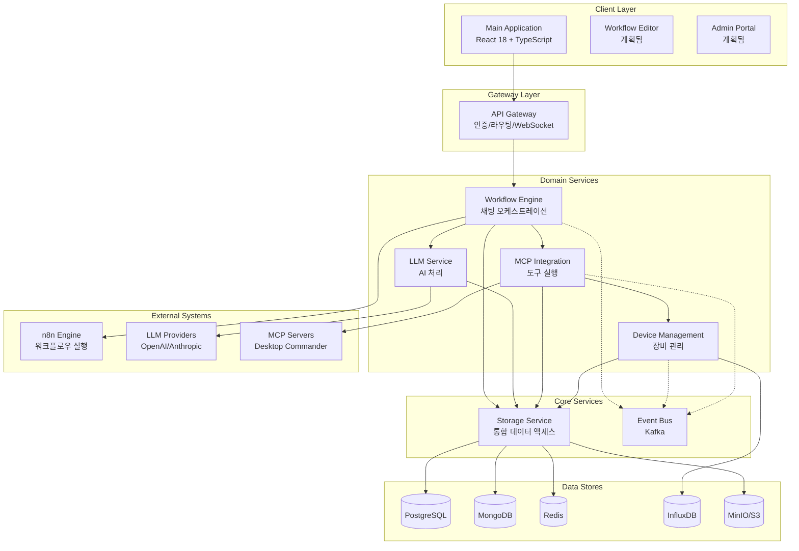

# 🚀 통합 자동화 시스템 v3.1

<div align="center">


**자연어 기반 IT 인프라 자동화 플랫폼**

*n8n + MCP (Model Context Protocol) + LLM 통합 오케스트레이션*

[🎯 현재 상태](#-현재-프로젝트-상태) •
[🏗️ 아키텍처](#️-시스템-아키텍처) •
[🚀 빠른 시작](#-빠른-시작) •
[📊 서비스 현황](#-서비스-구현-현황) •
[🔧 개발 가이드](#-개발-가이드) •
[📝 문서](#-프로젝트-문서)

</div>

---

## 📌 프로젝트 개요

통합 자동화 시스템 v3.1은 자연어로 IT 인프라를 제어하는 차세대 자동화 플랫폼입니다. n8n 워크플로우 엔진과 MCP 프로토콜을 통합하여 개발자와 시스템 관리자가 복잡한 인프라 작업을 대화형으로 수행할 수 있게 합니다.

### 🎯 핵심 가치
- **자연어 인터페이스**: "모든 서버 상태 확인해줘" 같은 일상 언어로 명령
- **시각적 워크플로우**: n8n 기반 드래그앤드롭 워크플로우 편집
- **확장 가능한 통합**: MCP 프로토콜로 다양한 도구와 시스템 연결
- **실시간 오케스트레이션**: LLM 기반 지능형 작업 조율

---

## 🎉 현재 프로젝트 상태

### 📊 전체 진행률: **40%** (2025-08-07 기준)

```
전체 시스템: ████████░░░░░░░░░░░░ 40%

세부 영역별 진행률:
━━━━━━━━━━━━━━━━━━━━━━━━━━━━━━━━━━━━━━━
✅ 인프라 구성:     ████████████████████ 100%
✅ 데이터베이스:    ████████████████████ 100%  
✅ Core Services:   ████████████████████ 100%
⚠️ Domain Services: ██████████████░░░░░░ 70%
🔄 서비스 통합:     ██████░░░░░░░░░░░░░░ 30%
✅ LLM 연동:        ████████████████████ 100%
🔄 n8n 통합:        ████████████████████ 100%
⚠️ MCP 연동:        ████████████░░░░░░░░ 60%
✅ 메인 UI:         ████████████████████ 100%
❌ 추가 UI:         ░░░░░░░░░░░░░░░░░░░░ 0%
⚠️ 이벤트 처리:     ████░░░░░░░░░░░░░░░░ 20%
❌ 모니터링:        ░░░░░░░░░░░░░░░░░░░░ 0%
━━━━━━━━━━━━━━━━━━━━━━━━━━━━━━━━━━━━━━━
```

### ✅ 최근 완료된 작업 (2025-08-06)
- **TASK-WF-001**: Workflow Engine Mock 제거 및 실제 LLM 연동 완료
- **n8n 분리**: 독립 마이크로서비스로 n8n 분리 성공
- **LLM 통합**: 의도 분석 및 응답 생성 100% 작동
- **Prisma 전환**: TypeORM → Prisma 5.x 마이그레이션 완료

### 🔄 진행 중인 작업
- **TASK-WF-002**: n8n 워크플로우 실제 실행 구현
- **TASK-WF-003**: MCP Service 실제 연동
- **데이터 일관성**: PostgreSQL/MongoDB 데이터 통합

---

## 🏗️ 시스템 아키텍처

### v3.1 간소화된 마이크로서비스 구조



### 📦 기술 스택

| 영역 | 기술 | 버전 | 상태 |
|------|------|------|------|
| **Frontend** | React + TypeScript + Vite | 18 + 5.x | ✅ |
| **Backend** | Node.js + Express | 20 LTS | ✅ |
| **Database** | PostgreSQL + Prisma | 14 + 5.x | ✅ |
| **NoSQL** | MongoDB + Redis | 6 + 7 | ✅ |
| **Workflow** | n8n | Latest | ✅ |
| **Message Queue** | Apache Kafka | 3.x | ⚠️ |
| **Container** | Docker + Compose | Latest | ✅ |
| **AI/LLM** | LangChain + OpenAI | Latest | ✅ |
| **Protocol** | MCP (Model Context Protocol) | 1.0 | ✅ |

---

## 🚀 빠른 시작

### 필수 요구사항
- Docker Desktop (macOS/Windows) 또는 Docker Engine (Linux)
- 최소 16GB RAM (권장 32GB)
- 30GB+ 디스크 공간
- Node.js 20+ (개발 시)

### 설치 및 실행

```bash
# 1. 저장소 클론
git clone https://github.com/iteasy-ops-dev/automation-system.git
cd automation-system

# 2. 환경 변수 설정
cp .env.example .env
# .env 파일 편집하여 필요한 API 키 설정

# 3. 프로덕션 빌드 (No-Cache)
docker-compose build --no-cache

# 4. 전체 시스템 시작
docker-compose up -d

# 5. 시스템 상태 확인
docker ps --format "table {{.Names}}\t{{.Status}}" | grep automation

# 6. 메인 애플리케이션 접속
open http://localhost:3001
```

### 기본 인증 정보
- **Admin Portal**: admin / Admin123!@#
- **n8n**: admin / Admin123!@#
- **MinIO**: admin / Admin123!@#

---

## 📊 서비스 구현 현황

### ✅ 완전 구현된 서비스 (5/8)

| 서비스 | 포트 | 설명 | 구현도 | API 문서 |
|--------|------|------|--------|----------|
| **Storage Service** | 8001 | 통합 데이터 액세스 레이어 | 100% | [API](./docs/api/storage.md) |
| **API Gateway** | 8080 | 인증/라우팅/WebSocket | 100% | [API](./docs/api/gateway.md) |
| **Device Service** | 8101 | 장비 관리 및 모니터링 | 100% | [API](./docs/api/device.md) |
| **LLM Service** | 8301 | AI 처리 및 프롬프트 관리 | 100% | [API](./docs/api/llm.md) |
| **Main Application** | 3001 | React 기반 웹 UI | 100% | - |

### ⚠️ 부분 구현된 서비스 (3/8)

| 서비스 | 포트 | 설명 | 구현도 | 남은 작업 |
|--------|------|------|--------|-----------|
| **Workflow Engine** | 8401 | 채팅 기반 오케스트레이션 | 70% | MCP 연동, n8n 실행 |
| **MCP Service** | 8201 | MCP 프로토콜 통합 | 80% | 실제 도구 실행 |
| **n8n Engine** | 5678 | 워크플로우 실행 엔진 | 60% | API 연동 완성 |

### ❌ 미구현 서비스 (2개)

| 서비스 | 계획 | 우선순위 | 예상 기간 |
|--------|------|----------|-----------|
| **Workflow Editor** | n8n 임베딩 UI | Medium | 2주 |
| **Admin Portal** | 관리자 대시보드 | Low | 2주 |

---

## 📁 프로젝트 구조

```
automation-system/
├── frontend/               # 프론트엔드 애플리케이션
│   └── main-app/          # ✅ 메인 React 앱
├── services/              # 백엔드 마이크로서비스
│   ├── core/
│   │   ├── gateway/       # ✅ API Gateway
│   │   └── storage/       # ✅ Storage Service
│   └── domain/
│       ├── device-management/  # ✅ Device Service
│       ├── llm-service/        # ✅ LLM Service
│       ├── mcp-integration/    # ⚠️ MCP Service
│       └── workflow-engine/    # ⚠️ Workflow Engine
├── shared/                # 공유 리소스
│   ├── contracts/         # API 계약 (OpenAPI 3.0)
│   ├── types/            # TypeScript 타입 정의
│   └── utils/            # 공통 유틸리티
├── infrastructure/        # 인프라 설정
│   ├── docker/           # Docker 설정
│   ├── kafka/            # Kafka 토픽 정의
│   └── monitoring/       # 모니터링 설정 (계획)
├── scripts/              # 유틸리티 스크립트
│   ├── backup/           # 백업/복원
│   ├── migration/        # DB 마이그레이션
│   └── test/            # 테스트 스크립트
└── docs/                 # 프로젝트 문서
    ├── architecture/     # 아키텍처 설계
    ├── api/             # API 문서
    └── guides/          # 사용자 가이드
```

---

## 🔧 개발 가이드

### 개발 워크플로우

```bash
# 1. 개별 서비스 개발
cd services/domain/workflow-engine
npm install
npm run dev

# 2. 로컬 빌드 및 테스트
docker-compose build --no-cache workflow-engine
docker-compose up -d workflow-engine

# 3. 로그 확인
docker logs automation-workflow-engine -f

# 4. API 테스트
curl http://localhost:8401/health
```

### 주요 명령어

```bash
# 시스템 관리
./scripts/start-system-safe.sh    # 안전한 시작
./scripts/create-safe-backup.sh   # 백업 생성
./scripts/manual-migration.sh     # DB 마이그레이션

# 개발 도구
docker-compose logs -f [service]  # 실시간 로그
docker exec -it [container] sh    # 컨테이너 접속
npm run test                       # 테스트 실행
npm run contracts:validate        # API 계약 검증
```

### 코딩 표준
- **TypeScript 5.x** 엄격 모드
- **ESLint + Prettier** 자동 포맷팅
- **Conventional Commits** 커밋 메시지
- **API First** 계약 우선 개발
- **테스트 커버리지** 최소 80%

---

## 📝 프로젝트 문서

### 핵심 문서
- [🏗️ 아키텍처 설계서](./docs/architecture/v3.1-architecture.md)
- [📋 상세 개발 TASK](./docs/tasks/development-tasks.md)
- [🔄 Prisma 마이그레이션 가이드](./docs/guides/prisma-migration.md)
- [💾 백업/복원 가이드](./BACKUP-RESTORE-GUIDE.md)

### API 문서
- [Storage Service API](./shared/contracts/v1.0/rest/core/storage-api.yaml)
- [Gateway API](./shared/contracts/v1.0/rest/core/gateway-auth.yaml)
- [Device Service API](./shared/contracts/v1.0/rest/domain/device-service.yaml)
- [MCP Service API](./shared/contracts/v1.0/rest/domain/mcp-service.yaml)
- [LLM Service API](./shared/contracts/v1.0/rest/domain/llm-service.yaml)
- [Workflow Service API](./shared/contracts/v1.0/rest/domain/workflow-service.yaml)

### 완료 보고서
- [TASK-4: Storage Service (Prisma)](./TASK-4-PRISMA-COMPLETION-REPORT.md)
- [TASK-5: API Gateway](./TASK-5-COMPLETION-REPORT.md)
- [TASK-6: Event Bus](./TASK-6-COMPLETION-REPORT.md)
- [TASK-7: Device Service](./TASK-7-VERIFICATION-REPORT.md)
- [TASK-8: MCP Service](./TASK-8-COMPLETION-REPORT.md)
- [TASK-9: Main Application](./TASK-9-COMPLETION-REPORT.md)

---

## ⚠️ 알려진 이슈 및 해결 방안

### 🔴 Critical Issues

| 이슈 | 영향 | 상태 | 해결 방안 |
|------|------|------|-----------|
| **Workflow 실행 미완성** | 핵심 자동화 기능 미작동 | 진행 중 | TASK-WF-002 작업 중 |
| **Kafka 토픽 오류** | 이벤트 통신 실패 | 대기 중 | 토픽 재생성 스크립트 준비 |
| **n8n 헬스체크 실패** | 상태 모니터링 불가 | 조사 중 | 헬스체크 엔드포인트 수정 필요 |

### 🟡 Known Limitations

- **모니터링 미구현**: Prometheus/Grafana 설정 필요
- **테스트 커버리지 부족**: 현재 0%, 목표 80%
- **UI 앱 미완성**: Workflow Editor, Admin Portal 미구현

---

## 🚀 로드맵

### Phase 1: MVP 완성 (현재 ~ 2주)
- [x] ✅ LLM Service 통합
- [x] ✅ n8n 마이크로서비스 분리
- [ ] 🔄 MCP 실제 도구 실행
- [ ] 🔄 워크플로우 실제 실행
- [ ] 데이터 일관성 해결

### Phase 2: 기능 완성 (3-4주)
- [ ] Workflow Editor UI
- [ ] Admin Portal
- [ ] Kafka 이벤트 시스템
- [ ] 통합 테스트 자동화

### Phase 3: 프로덕션 준비 (5-6주)
- [ ] 모니터링 시스템 구축
- [ ] 성능 최적화
- [ ] 보안 강화
- [ ] 문서화 완성
- [ ] CI/CD 파이프라인

---

## 👥 기여 가이드

### 기여 방법
1. Fork the repository
2. Create your feature branch (`git checkout -b feature/AmazingFeature`)
3. Commit your changes (`git commit -m 'Add some AmazingFeature'`)
4. Push to the branch (`git push origin feature/AmazingFeature`)
5. Open a Pull Request

### 코드 리뷰 체크리스트
- [ ] TypeScript 컴파일 에러 없음
- [ ] ESLint 경고 없음
- [ ] 테스트 통과
- [ ] API 계약 준수
- [ ] 문서 업데이트

---

## 📄 라이선스

이 프로젝트는 MIT 라이선스를 따릅니다. 자세한 내용은 [LICENSE](LICENSE) 파일을 참조하세요.

---

## 🙏 감사의 말

이 프로젝트는 다음 오픈소스 프로젝트들의 도움으로 만들어졌습니다:
- [n8n](https://n8n.io) - Workflow automation
- [Prisma](https://prisma.io) - Next-generation ORM
- [LangChain](https://langchain.com) - LLM framework
- [React](https://react.dev) - UI library

---

<div align="center">

**통합 자동화 시스템 v3.1**

*Building the future of infrastructure automation*

[🏠 홈](https://github.com/iteasy-ops-dev/automation-system) •
[📧 문의](mailto:iteasy.ops.dev@gmail.com) •
[🐛 이슈](https://github.com/iteasy-ops-dev/automation-system/issues)

</div>
